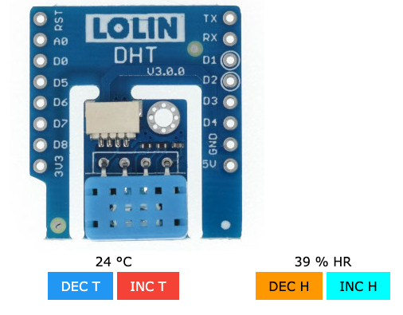

# Mòdul DHT: sensor d'humitat i temperatura

Farem servir el mòdul virtual DHT: http://localhost:5000/dht

i haureu de carregar l'arxiu **A0.py**

## Explicació del codi

El mòdul DHT fa servir l'ordre sensor.measure() per fer un mesurament. Un cop hàgim fet aquest mesurament podem obtenir les dades d'humitat i temperatura fen servir els ordres sensor.humidity() i sensor.temperature() respectivament

Al codi es fa servir l'ordre `print("Text", sensor.humidity(), "Text")` que serveix per mostrar per consola el text que estigui entre cometes i el valor que hem capturat gràcies al mòdul DHT.

També podeu veure al codi d'exemple que hi ha una nova ordre: `time.sleep(X)` serveix perquè el programa esperi un número X de segons abans d'executar l'ordre següent.

## Codi original 

Aquí teniu una còpia del codi original per si ho perdeu fent proves i ho vulgueu recuperar:

~~~

from D1mini import *
while True:
    sensor.measure()
    print("La temperatura ambiental es de", sensor.temperature(), "graus Celsius")
    print("Hi ha un", sensor.humidity(), "% d'humitat relativa")
    time.sleep(4)
~~~

## Activitat 0 - Què s'ha de fer?

Seguiu els passos que hi ha a l'apartat d'Informació més a dalt per configurar l'entorn de treball.

Feu proves canviant els valors de temperatura i humitat del mòdul virtual DHT i veien com canvia la sortida a la pantalla de consola que teniu a sota.

Proveu de canviar el text que surt a la pantalla de consola.

Un cop que hàgiu fet les proves suficients i hàgiu après el funcionament de l'entorn i el mòdul, lliureu l'activitat.

Aquesta activitat no compta per la nota, però us servirà per fer proves i variacions amb el codi i familiaritzar-vos amb l'entorn per estar preparats per fer les següents activitats.

