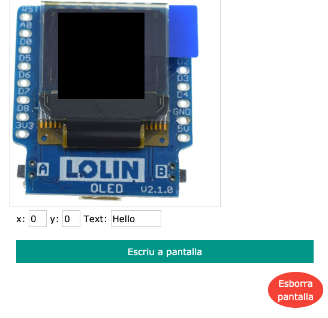

# Mòdul OLED: pantalla

## Informació

Farem servir el mòdul virtual OLED: http://localhost:5000/oled

i també haureu de carregar el fitxer **A1.py** a l'entorn de programació Python

Comproveu el que el mòdul virtual funciona correctament abans de posar-vos a manipular el codi.

## Explicació del codi

La pantalla té 64 píxels d'ample (eix X) i 48 píxels d'alt (eix Y).

Si executeu el codi que teniu al fitxer main.py, veureu que a la pantalla del mòdul virtual OLED apareix la frase "Hello, world!" centrada en la pantalla.

A continuació es fa una petita explicació de les ordres que es fan servir:

`display.fill(0)` - Esborra la pantalla

`display.text('Hello,', 10, 10)` - Dona l'ordre d'escriure la paraula Hello, començant a escriure al píxel 10 de l'eix X i al píxel 10 de l'eix Y.

`display.text('World!,', 10, 20)` - Dona l'ordre d'escriure la paraula World! començant a escriure al píxel 10 de l'eix X i al píxel 20 de l'eix Y.

`display.show()` - Escriu a la pantalla les ordres que em donat abans.

## Codi original

Aquí teniu una còpia del codi original per si ho perdeu fent proves i ho vulgueu recuperar:

~~~
from D1mini import *
display.fill(0)
display.text('Hello,', 10, 10)
display.text('World!', 10, 20)
display.show()
~~~

## Activitat 1 - Què s'ha de fer?

Seguiu els passos que hi ha a l'apartat d'Informació més a dalt per configurar l'entorn de treball.

Seguint l'exemple que teniu, modifiqueu el codi perquè mostri a la pantalla el vostre nom i el vostre curs.

Un cop que el codi estigui preparat, verificat i faci el que es demana, lliureu l'activitat.
