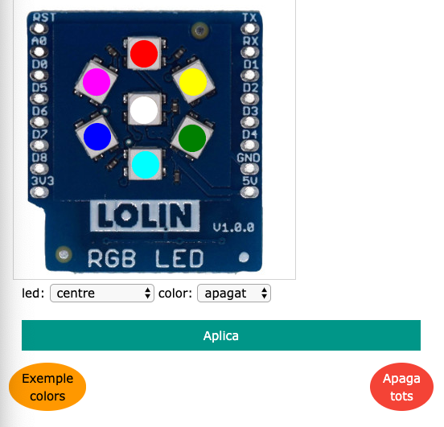

# Mòdul RGB: leds de colors

## Informació:

Farem servir el mòdul virtual RGB: http://localhost:5000/rgb

i també haureu de carregar el fitxer **A2.py** a l'entorn de programació Python

Comproveu el que el mòdul virtual funciona correctament abans de posar-vos a manipular el codi.

## Explicació del codi

Aquest mòdul és un conjunt de 7 leds que podem programar perquè tinguin diferents estats, encesos amb un color determinat o apagats.

Podem programar cadascun dels leds fent servir l'ordre:

`led[X] = color['estat']` on

`led[X]` - fa referència a un dels leds segon la seva posició. Haureu d'endevinar quin número actua amb el led corresponent

`color['estat']` - on estat fa referència a l'estat que amb què volem programar el led. Pot tenir diferents colors (blanc, vermell, groc, verd, cyan, blau i magenta) o pot estar apagat.

Finalment, guardem i executem la programació que volem de cadascun dels leds fent servir l'ordre led.write()

## Codi original

Aquí teniu una còpia del codi original per si ho perdeu fent proves i ho vulgueu recuperar:

~~~
from D1mini import *

led[0] = color['blanc']
led[1] = color['vermell']
led[2] = color['groc']
led[3] = color['verd']
led[4] = color['cyan']
led[5] = color['blau']
led[6] = color['magenta']
led.write()

while True:
    time.sleep(1)
    led[0] = color['apagat']
    led.write()
    time.sleep(1)
    led[0] = color['blanc']
    led.write()
 ~~~
 
## Activitat 2 - Què s'ha de fer?

Seguiu els passos que hi ha a l'apartat d'Informació més a dalt per configurar l'entorn de treball.

Modifiqueu el codi d'exemple per aconseguir que els leds formin una creu amb leds de color vermell.

Un cop que el codi estigui preparat, verificat i faci el que es demana, lliureu l'activitat.

## Activitat 2 Extra - Què s'ha de fer?

Aquesta és una activitat extra. No és obligatori fer-la, però si la feu, obtindreu alguns punts extres que pujaran la vostra nota final.

Seríeu capaços de fer que la creu que heu fet a l'Activitat 2, s'encengui i apagui cada segon canviant de color? És a dir que sigui una creu intermitent amb colors diferents.

Un cop que el codi estigui preparat, verificat i faci el que es demana, lliureu l'activitat.

