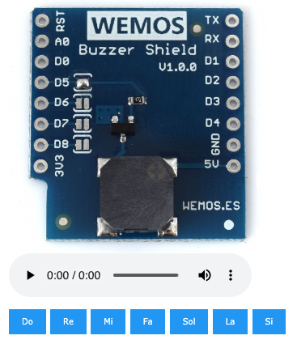

# Mòdul Buzzer: brunzidor

## Informació

Farem servir el mòdul virtual buzzer: http://localhost:5000/buzzer

i també haureu de carregar el fitxer **A3.py** a l'entorn de programació Python

Comproveu el que el mòdul virtual funciona correctament abans de posar-vos a manipular el codi.

## Explicació del codi

Aquest mòdul és un brunzidor que podem programar perquè faci sonar una nota musical. Per aconseguir-ho, l'únic que hem de fer és utilitzar l'ordre toca('nota') on nota correspon a la nota musical que volem que soni.
Codi original

Aquí teniu una còpia del codi original per si ho perdeu fent proves i ho vulgueu recuperar:

~~~
from D1mini import *
toca('do')
time.sleep(1)
toca('re')
time.sleep(1)
toca('mi')
time.sleep(1)
toca('fa')
time.sleep(1)
toca('sol')
time.sleep(1)
toca('la')
time.sleep(1)
toca('si')
time.sleep(1)
~~~

## Activitat 4 - Què s'ha de fer?

Seguiu els passos que hi ha a l'apartat d'Informació més a dalt per configurar l'entorn de treball.

Creeu un programa que toqui la teva cançó preferida. No és necessari que sigui la cançó completa, amb les primeres notes ja és suficient.

Un cop que el codi estigui preparat, verificat i faci el que es demana, lliureu l'activitat
