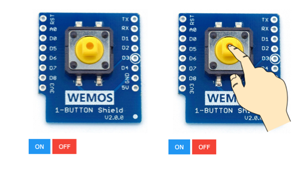

# Mòdul Button: polsador
## Informació

Farem servir el mòdul virtual Switch: http://localhost:5000/switch

## Explicació del codi

Aquest mòdul és molt senzill, es tracta d'un botó que puc tenir dos estats: premut (ON) i no premut (OFF).

Per saber en quin estat està el polsador, farem servir l'ordre `polsador()` Aquesta ordre tornarà un valor true si el polsador està premut i un valor false si no ho està.

## Codi original

Aquí teniu una còpia del codi original per si ho perdeu fent proves i ho vulgueu recuperar:

~~~
from D1mini import *
while True:
    if polsador():
        print("El boto esta premut.")
    else:
        print("El boto no esta premut.")
    time.sleep(1)
~~~

## Activitat 4 - Què s'ha de fer?

Seguiu els passos que hi ha a l'apartat d'Informació més a dalt per configurar l'entorn de treball.

En aquesta activitat, treballarem amb dos mòduls a l'hora:

Mòdul Buzzer: http://localhost:5000/buzzer    
Mòdul Switch: http://localhost:5000/switch

El funcionament és el mateix que en les activitats anteriors, només que en aquesta treballareu amb dos mòduls.

Seríeu capaços de fer que la cançó que vau programar en l'Activitat 3 soni només quan el polsador estigui premut?

Un cop que el codi estigui preparat, verificat i faci el que es demana, lliureu l'activitat
