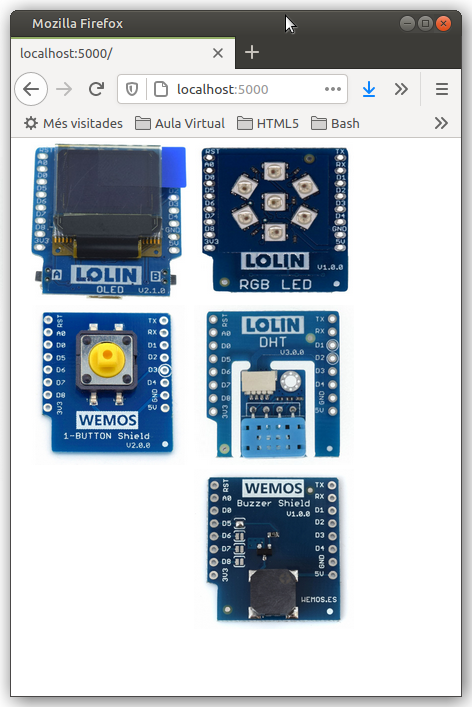

# micropython-virtual
Laboratori virtual micropython D1 mini

Activitats per treballar micropython a 3r d'ESO

Les activitats pels alumnes es troben a la carpeta **Estació Meteorològica**

Cal carregar la llibreria **D1mini.py** per poder accedir a les funcions del laboratori virtual

# Instal·lació

En descomprimir aquest repositori trobareu una carpeta principal amb el programa *labvir.py* que caldrà executar amb
`python3 labvir.py` des d'un terminal a aquesta carpeta. El laboratori el trobareu a http://localhost:5000/

Prèviament caldrà instal·lar un entorn de desenvolupament Python (aquí teniu instruccions per *Thonny*) i la biblioteca *Flask*

## GNU/Linux

~~~
sudo apt install python3 python3-pip python3-tk thonny
sudo pip3 install Flask
~~~

## Windows

Si encara no tens python instal·lat, baixa'l i instal·la'l des de la seva web https://www.python.org/downloads/windows/

Cal baixar i instal·lar *thonny* des de la seva web https://thonny.org/

Ara et caldrà instal·lar *Flask* des d'un terminal

~~~
sudo pip3 install Flask
~~~

