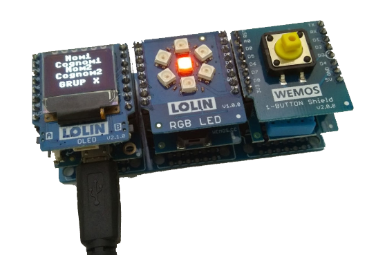

# Programació amb D1 mini físic i shields reals

A la carpeta *lib* trobareu les llibreries que cal carregar a l'entorn micropython per a un D1 mini real

**Al shield RGB cal canviar la connexió: utilitzem el pin D8** 

A la carpeta *firmware* trobareu el micropyton per al D1 mini

